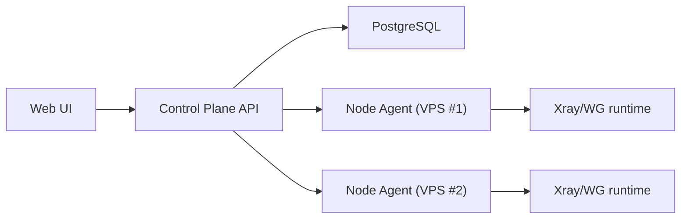
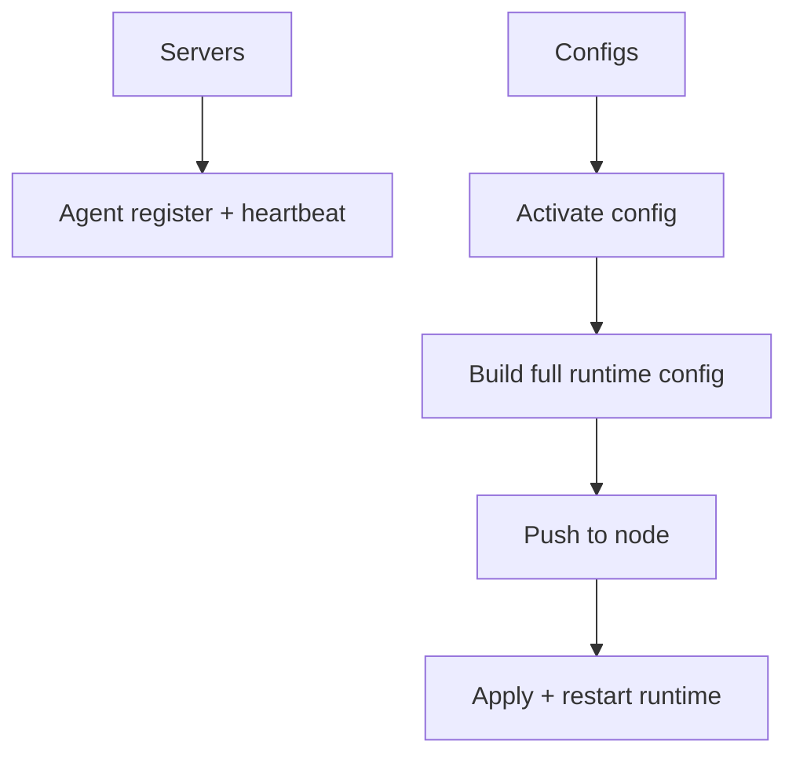

# void-wg

Canonical repo: [wester11/v-ui](https://github.com/wester11/v-ui)

Production SaaS-style VPN panel for Xray, WireGuard, and AmneziaWG with separated control-plane and node onboarding flow.

## Overview

void-wg now follows Remnawave-like architecture:

- `Server` = infrastructure node metadata (VPS, connection, health)
- `Config` = VPN logic (Xray/WG/AWG settings and routing)

Flow:

1. Create server in panel (`Servers -> Add Server`)
2. Copy generated install command
3. Run on VPS
4. Node auto-registers and appears `ONLINE`
5. Create and activate VPN config in `Configs`

## Features

- Server / Config separation
- Auto node registration by `node_id + secret`
- Node install command generation
- Config modes:
  - `Simple`
  - `Advanced (raw JSON)`
- Config templates:
  - `VLESS Reality`
  - `gRPC Reality`
  - `Cascade`
  - `Empty`
- Cascade routing:
  - `geoip:ru -> direct`
  - `geoip:!ru -> proxy`
- Fleet health and bulk redeploy
- Daily auto-update timer with rollback
- RU/EN language switch in UI

## Installation

```bash
bash <(curl -Ls https://raw.githubusercontent.com/wester11/v-ui/main/scripts/install.sh)
```

## Node Onboarding

After creating a server, panel returns:

- `node_id`
- `secret`
- install command
- docker compose snippet

Example command:

```bash
bash <(curl -Ls https://panel.example.com/install-node.sh) \
  --control-url=https://panel.example.com \
  --node-id=UUID \
  --secret=SECRET
```

## Config Modes

### Simple

Form-driven setup:

- port
- SNI
- dest
- fingerprint
- flow
- routing mode

### Advanced

Raw Xray JSON input with validation.
Control-plane injects users into VLESS `clients[]` during deploy.

## Cascade / Multi-hop

Use routing mode `cascade` and choose upstream node.

Example behavior:

- RU traffic stays local
- global traffic goes through upstream node

## Architecture





## API Highlights

- `POST /api/v1/servers` -> create infra node + install command
- `POST /api/v1/agent/register` -> node registration
- `POST /api/v1/agent/heartbeat` -> health heartbeat
- `POST /api/v1/configs` -> create config
- `POST /api/v1/configs/{id}/activate` -> activate + deploy
- `GET /api/v1/servers/{id}/configs` -> list server configs

## Ops

Update:

```bash
sudo bash /opt/void-wg/scripts/update.sh
```

Auto-update timer:

```bash
systemctl status void-wg-update.timer
```

CLI:

```bash
sudo v-wg status
sudo v-wg update
sudo v-wg logs
```

## Troubleshooting

If panel is not reachable:

```bash
cd /opt/void-wg
docker compose ps
docker compose logs -f
```

If node is not online:

1. Verify install command parameters (`control-url`, `node-id`, `secret`)
2. Check node container logs on VPS
3. Click `Check connection` in server onboarding modal

