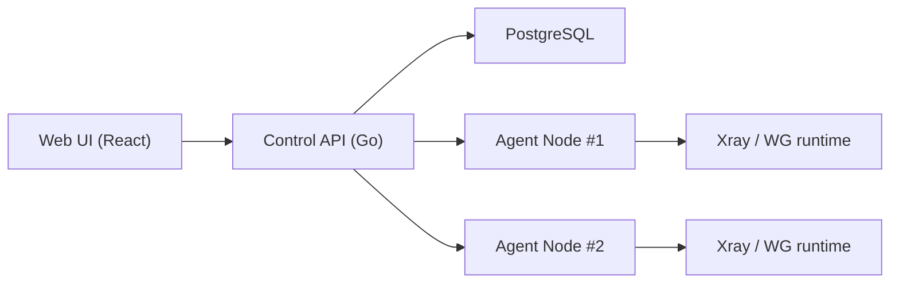
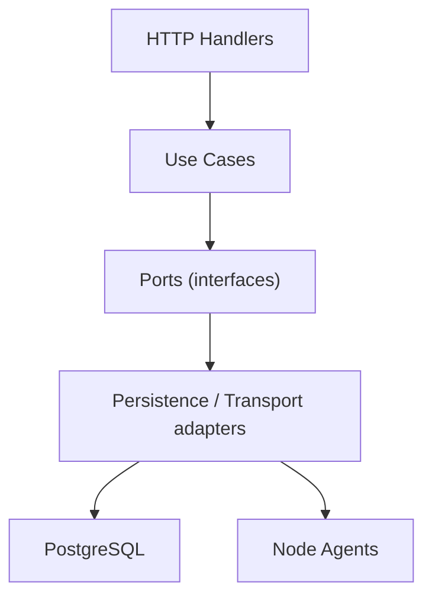

# void-wg

> Canonical repository: [wester11/v-ui](https://github.com/wester11/v-ui)

Production-grade VPN control plane for **WireGuard**, **AmneziaWG**, and **Xray (VLESS+Reality)**.

void-wg is designed as a SaaS-style panel with a clean backend architecture, stateless node agents, and a practical operator UX for real infrastructure.

## 🚀 Overview

void-wg helps you run and scale VPN infrastructure from one panel:
- Register nodes (WG/AWG/Xray)
- Provision client access in one click
- Manage configs and QR codes
- Track node health and audit actions
- Run fleet operations (bulk redeploy)
- Use **cascade routing** for multi-hop traffic paths

Compared to classic MVP panels, this project focuses on:
- explicit operator workflows
- production-safe scripts
- idempotent install/update lifecycle
- clean domain/use-case/repository layering

## ⚙️ Features

- Multi-protocol control plane:
  - WireGuard
  - AmneziaWG (UDP obfuscation parameters)
  - Xray VLESS+Reality
- Stateless node model (control plane renders config, agent applies)
- JWT auth + RBAC (`admin` / `operator` / `user`)
- Audit log endpoint and UI page
- Fleet health API (`online` / `offline` / `degraded`)
- Bulk Xray redeploy with retry
- Cascade mode for Xray servers:
  - `geoip:ru -> direct`
  - `geoip:!ru -> proxy (upstream)`
- Production scripts:
  - one-click install
  - safe update with rollback
  - cert renew
  - uninstall
- systemd timers:
  - TLS renew timer
  - daily auto-update timer

## 📦 Installation (one command)

```bash
bash <(curl -Ls https://raw.githubusercontent.com/wester11/v-ui/main/scripts/install.sh)
```

Installer is idempotent and non-interactive-safe by default.

What it does:
1. Installs prerequisites and Docker
2. Clones repo to `/opt/void-wg`
3. Creates `.env` if missing
4. Configures TLS mode
5. Configures firewall ports
6. Installs systemd units/timers and `v-wg` CLI
7. Builds and starts `docker compose`
8. Prints panel URL and credentials

## 🔐 TLS Modes

Supported modes:
- `letsencrypt` (recommended for domain)
- `selfsigned` (IP-based quick start)

Main scripts:
- install: `/opt/void-wg/scripts/install.sh`
- renew: `/opt/void-wg/scripts/renew-cert.sh`

## 🔄 Update & Auto-update

### Manual update

```bash
sudo bash /opt/void-wg/scripts/update.sh
```

`update.sh` guarantees:
- `git fetch` + `git reset --hard origin/main`
- `docker compose pull`
- `docker compose up -d --build --remove-orphans`
- no destruction of `.env`, runtime data, or TLS files
- logging to `/var/log/void-wg-install.log`
- rollback to previous commit if update fails

### Automatic daily update

Installed units:
- `void-wg-update.service`
- `void-wg-update.timer`

Check status:

```bash
systemctl status void-wg-update.timer
systemctl list-timers | grep void-wg-update
```

## 🧠 Architecture

### Control-plane / Agent model



### Backend layering



Key properties:
- domain-first data structures
- use-case orchestration
- adapters hidden behind ports
- deployment/runtime logic isolated in transport layer

## 🔥 Cascade VPN (multi-hop)

Scenario:
- Server A (RU ingress)
- Server B (EU upstream)

Client connects to Server A.
Server A routes:
- RU traffic -> direct
- non-RU traffic -> Server B

### UI flow

When creating Xray server:
- Mode: `Standalone` or `Cascade`
- If `Cascade`:
  - choose upstream server
  - choose rules (`geoip:ru direct`, `geoip:!ru proxy`)

### Backend flow

- Cascade settings are stored in Xray `protocol_config`
- Control-plane generates:
  - upstream outbound (`cascade-upstream`)
  - geo routing rules
- Full Xray JSON is rebuilt in one place (`BuildFullConfig`)

### Example routing fragment

```json
{
  "routing": {
    "rules": [
      {"type": "field", "ip": ["geoip:ru"], "outboundTag": "direct"},
      {"type": "field", "ip": ["geoip:!ru"], "outboundTag": "cascade-upstream"}
    ]
  }
}
```

## 📊 Panel Screens

Main pages:
- Dashboard
- Servers
- Clients
- Configs / Access
- Logs / Audit
- Settings

If you keep screenshots in repo, use this block:

```md


```

## 🧩 Use Cases

1. Personal secure tunnel with quick self-signed bootstrap
2. Team VPN with operator role and audited admin actions
3. Geo-aware traffic split using Xray cascade mode
4. Daily unattended updates via systemd timer
5. Centralized fleet health checks and bulk redeploy

## 🛠 Dev Setup

### Backend

```bash
cd backend
# if Go toolchain is installed locally
# go mod tidy
# go run ./cmd/api
```

### Frontend

```bash
cd frontend
npm install
npm run dev
```

### Full stack

```bash
docker compose up -d --build
```

## 🧰 CLI (`v-wg`)

`v-wg` provides menu + aliases.

Examples:

```bash
sudo v-wg status
sudo v-wg update
sudo v-wg logs
sudo v-wg renew
```

`v-wg update` runs the same safe `scripts/update.sh` flow.

## ❗ Troubleshooting

### `ERR_CONNECTION_REFUSED`

Most common causes:
- cloud firewall/security group blocks panel port
- panel is listening on another HTTPS port

Quick recovery:

```bash
cd /opt/void-wg
PANEL_HTTPS_PORT=443 PANEL_RANDOM_HTTPS_PORT=0 bash scripts/install.sh
```

Then open URL printed by installer.

### Containers restarting

```bash
cd /opt/void-wg
docker compose ps
docker compose logs -f
```

### Permission issues for runtime dirs

Check:

```bash
ls -la /opt/void-wg/runtime
ls -la /opt/void-wg/runtime/agent-ca
```

### Update failed

- read `/var/log/void-wg-install.log`
- updater performs rollback automatically
- rerun manually after issue is fixed:

```bash
sudo bash /opt/void-wg/scripts/update.sh
```

## 🔐 Security Notes

- Keep `.env` private (`chmod 600`)
- Prefer domain + Let's Encrypt for production
- Restrict management access by network policy
- Rotate credentials regularly

## 📄 License

MIT
